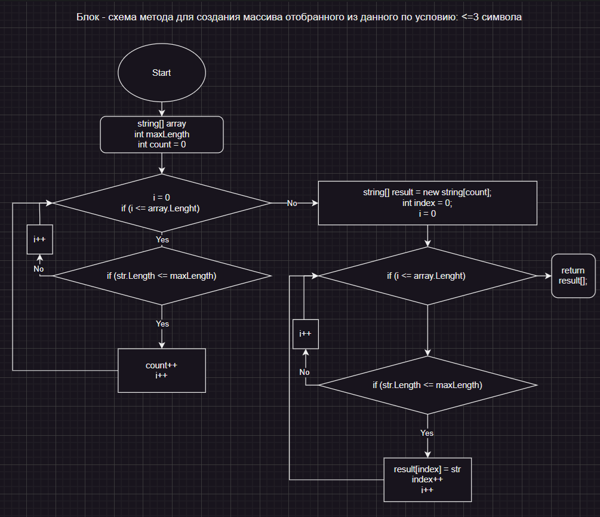

##  ЗАДАЧА 
Написать программу, которая из имеющегося массива строк формирует массив из строк, длина которых меньше либо равна 3 символа. Первоначальный массив можно ввести с клавиатуры, либо задать на старте выполнения алгоритма. При решении не рекомендуется пользоваться коллекциями, лучше обойтись исключительно массивами.

### Описание алгоритма решения задачи
*__B структуре программы используются следующие методы:__*

* __Main__ метод является точкой входа и координирует выполнение программы.
* __RequestArraySize__ запрашивает у пользователя размер массива.
* __ReadInputStrings__ читает строки, введенные пользователем, и сохраняет их в массиве.
* __FilterStrings__ фильтрует строки, оставляя только те, что подходят по условию (длина <= 3 символов).
* __CountSuitableStrings__ считает количество подходящих строк в массиве.
* __DisplayResults__ выводит исходный и отфильтрованный массивы на экран.

**_step 1:_** Запрос размера массива строк у пользователя

*__step 2:__* Ввод данных пользователем и сохранение в массиве

__*step 3:*__ Подсчет подходящих строк (длина не более 3 символов)

*__step 4:__* Выделение памяти под новый массив с подходящими строками

*__step 5:__* Заполнение нового массива подходящими строками

*__step 6:__* Вывод результатов [Исходный массив строк]; [Новый массив с подходящими строками (длина <= 3 символов)]

В представленном решении нет использования коллекций. Весь код работает исключительно с массивами

### string[] inputStrings

и

### string[] suitableStrings

 